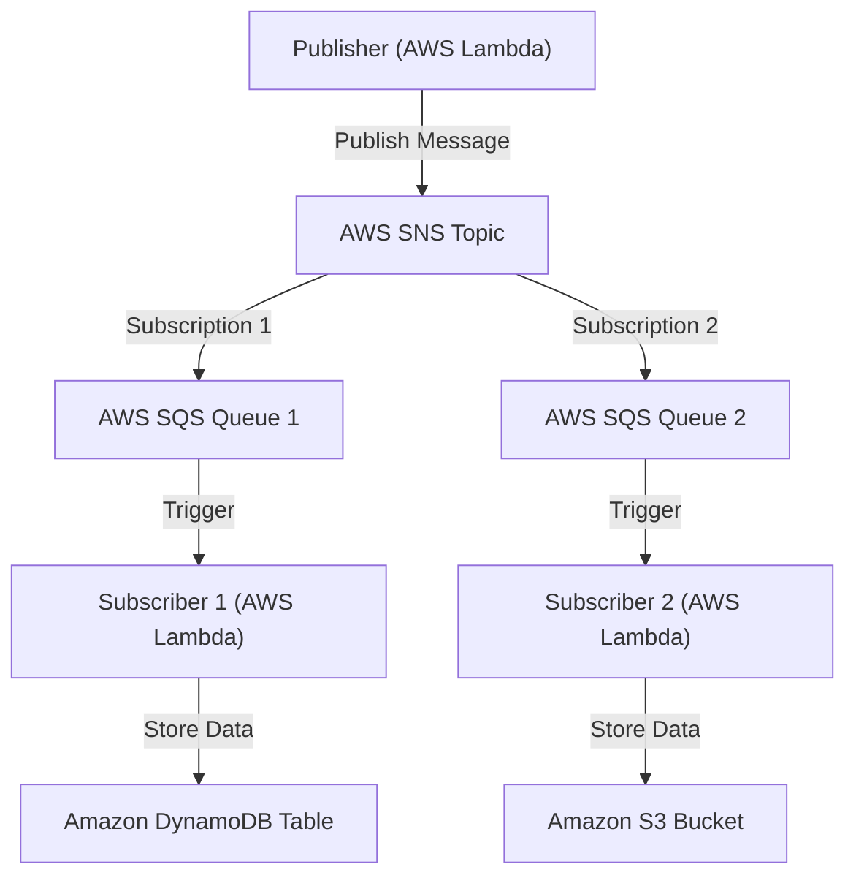

# AWS Publisher-Subscriber Pattern Implementation

This repository demonstrates how to implement the **Publisher-Subscriber Pattern** using AWS services, including AWS SNS, SQS, Lambda, DynamoDB, and S3. The project includes CloudFormation templates for infrastructure deployment, Python code for the publisher and subscribers, and GitHub Actions workflows for continuous integration and deployment.

## 🏗️ Architecture Overview

### Components of the Architecture

1. **Publisher (AWS Lambda)**: A Lambda function that simulates an online webshop by sending order details (e.g., items ordered, customer information) to an **SNS Topic**.
2. **AWS SNS (Simple Notification Service)**: The messaging service that receives messages from the publisher and distributes them to its subscriptions (SQS queues).
3. **AWS SQS (Simple Queue Service)**:
   - **SQS Queue 1**: Consumed by **Subscriber 1** Lambda, which processes messages and stores data in DynamoDB.
   - **SQS Queue 2**: Consumed by **Subscriber 2** Lambda, which processes messages and stores data in S3.
4. **Subscriber 1 (AWS Lambda)**: A Lambda function that listens to messages from **SQS Queue 1** and stores the order details in **Amazon DynamoDB**.
5. **Subscriber 2 (AWS Lambda)**: A Lambda function that listens to messages from **SQS Queue 2** and stores the order details as JSON files in **Amazon S3**.
6. **Amazon DynamoDB**: For storing order details processed by **Subscriber 1**.
7. **Amazon S3**: For storing order details processed by **Subscriber 2**.

## 📂 Folder Structure

- **`/infrastructure`**: Contains the CloudFormation template for deploying AWS resources and a GitHub Action for automating the deployment.
- **`/publisher`**: Contains the Python code for the Publisher Lambda function and a GitHub Action to deploy it.
- **`/subscriber1`**: Contains the Python code for Subscriber 1 Lambda function and a GitHub Action to deploy it.
- **`/subscriber2`**: Contains the Python code for Subscriber 2 Lambda function and a GitHub Action to deploy it.

## 📝 How the Architecture Works

### Publisher

- The **Publisher Lambda** sends messages (order details) to an **SNS Topic**.

### AWS SNS and SQS

- **SNS Topic**: Receives messages from the Publisher and forwards them to **SQS Queues**.
- **SQS Queue 1 and Queue 2**: Receive messages from the SNS topic.

### Subscribers

- **Subscriber 1**: Listens to messages on **SQS Queue 1** and stores the data in **DynamoDB**.
- **Subscriber 2**: Listens to messages on **SQS Queue 2** and stores the data in **S3**.

## 🛠️ How to Start

### Prerequisites

1. **AWS Account**: An active AWS account.
2. **AWS CLI**: Installed and configured with the appropriate credentials.
3. **GitHub Repository**: Clone this repository to your local machine.
4. **GitHub Secrets Configuration**:
   - **`AWS_ACCESS_KEY_ID`**: Your AWS access key ID.
   - **`AWS_SECRET_ACCESS_KEY`**: Your AWS secret access key.

### Steps to Deploy

1. **Deploy Infrastructure**:
   - Navigate to the `/infrastructure` folder.
   - Run the GitHub Action to deploy the CloudFormation template.

2. **Deploy the Publisher**:
   - Navigate to the `/publisher` folder.
   - Run the GitHub Action to deploy the Publisher Lambda function.

3. **Deploy the Subscribers**:
   - Navigate to the `/subscriber1` and `/subscriber2` folders.
   - Run the respective GitHub Actions to deploy the Subscriber Lambda functions.

### Testing the Workflow

1. **Send a Message to the Publisher**:
   - Trigger the Publisher Lambda function from the AWS Lambda console or using AWS CLI.

2. **Monitor Subscribers**:
   - Use AWS CloudWatch Logs to monitor the executions of Subscriber 1 and Subscriber 2.

## 📄 License

This project is licensed under the MIT License - see the [LICENSE](LICENSE) file for details.
